# Behavioral Cloning for Autonomous Driving

[](http://www.udacity.com/drive)

Overview
---
This repository contains starting files for the Behavioral Cloning Project.

In this project, we use deep neural networks and convolutional neural networks to clone driving behavior from a human driver. 
The model was trained, validated and tested using Keras. Given a camera image, the model outputs a steering angle to an autonomous vehicle.

Udacity provided a simulator where one can steer a car around a track for data collection. You'll use image data and steering angles to train a neural network and then use this model to drive the car autonomously around the track.

To meet specifications, the project required submitting five files: 
* `model.py` and `model_nvidia.py` (scripts used to create and train the model; see [training.ipynb](training.ipynb) instead for more information about the data and process).
* `drive.py` (script to drive the car - feel free to modify this file)
* a report writeup file (you're reading it)
* `models/*.h5` (trained Keras models, e.g. `models/custom-1.89-0.0281.h5`)
* `video/*.mp4` (a video recordings of the vehicle driving autonomously around the track for at least one full lap, e.g. `video/custom-1.89-0.0281.mp4`)

The Project
---
The goals / steps of this project are the following:
* Use the simulator to collect data of good driving behavior 
* Design, train and validate a model that predicts a steering angle from image data
* Use the model to drive the vehicle autonomously around the first track in the simulator. The vehicle should remain on the road for an entire loop around the track.
* Summarize the results with a written report

### Dependencies
This lab requires:

* [CarND Term1 Starter Kit](https://github.com/udacity/CarND-Term1-Starter-Kit)

The lab enviroment can be created with CarND Term1 Starter Kit (click [here](https://github.com/udacity/CarND-Term1-Starter-Kit/blob/master/README.md) for the details)
or with Anaconda using the contained `environment.yml` file like by calling

```bash
conda env create -f environment.yml
```

Note that the project environment slightly deviates from the CarND Term1 Starter Kit, although using the kit could still work.

The following additional resources can be found in this github repository:
* `drive.py`
* `video.py`

The Unity based simulator can be downloaded from the classroom or found at [github.com/udacity/self-driving-car-sim](https://github.com/udacity/self-driving-car-sim).
In the classroom, we have also provided sample data that you can optionally use to help train your model.

## Details About Files In This Directory

### `drive.py`

Usage of `drive.py` requires you have saved the trained model as an h5 file, i.e. `model.h5`. See the [Keras documentation](https://keras.io/getting-started/faq/#how-can-i-save-a-keras-model) for how to create this file using the following command:
```sh
model.save(filepath)
```

Once the model has been saved, it can be used with drive.py using this command:

```sh
python drive.py model.h5
```

The above command will load the trained model and use the model to make predictions on individual images in real-time and send the predicted angle back to the server via a websocket connection.

Note: There is known local system's setting issue with replacing "," with "." when using drive.py. When this happens it can make predicted steering values clipped to max/min values. If this occurs, a known fix for this is to add "export LANG=en_US.utf8" to the bashrc file.

#### Saving a video of the autonomous agent

```sh
python drive.py model.h5 run1
```

The fourth argument, `run1`, is the directory in which to save the images seen by the agent. If the directory already exists, it'll be overwritten.

```sh
ls run1

[2017-01-09 16:10:23 EST]  12KiB 2017_01_09_21_10_23_424.jpg
[2017-01-09 16:10:23 EST]  12KiB 2017_01_09_21_10_23_451.jpg
[2017-01-09 16:10:23 EST]  12KiB 2017_01_09_21_10_23_477.jpg
[2017-01-09 16:10:23 EST]  12KiB 2017_01_09_21_10_23_528.jpg
[2017-01-09 16:10:23 EST]  12KiB 2017_01_09_21_10_23_573.jpg
[2017-01-09 16:10:23 EST]  12KiB 2017_01_09_21_10_23_618.jpg
[2017-01-09 16:10:23 EST]  12KiB 2017_01_09_21_10_23_697.jpg
[2017-01-09 16:10:23 EST]  12KiB 2017_01_09_21_10_23_723.jpg
[2017-01-09 16:10:23 EST]  12KiB 2017_01_09_21_10_23_749.jpg
[2017-01-09 16:10:23 EST]  12KiB 2017_01_09_21_10_23_817.jpg
...
```

The image file name is a timestamp of when the image was seen. This information is used by `video.py` to create a chronological video of the agent driving.

### `video.py`

```sh
python video.py run1
```

Creates a video based on images found in the `run1` directory. The name of the video will be the name of the directory followed by `'.mp4'`, so, in this case the video will be `run1.mp4`.

Optionally, one can specify the FPS (frames per second) of the video:

```sh
python video.py run1 --fps 48
```

Will run the video at 48 FPS. The default FPS is 60.

#### Why create a video

1. It's been noted the simulator might perform differently based on the hardware. So if your model drives succesfully on your machine it might not on another machine (your reviewer). Saving a video is a solid backup in case this happens.
2. You could slightly alter the code in `drive.py` and/or `video.py` to create a video of what your model sees after the image is processed (may be helpful for debugging).

### Tips
- Please keep in mind that training images are loaded in BGR colorspace using cv2 while drive.py load images in RGB to predict the steering angles.

## Writeup

Note that dataset exploration, model design and training has been done almost exclusively in the [training.ipynb](training.ipynb)
Jupyter notebook. For reviewing, its contents were exported to 

- `training_data.py` (loading the training data),
- `model_nvidia.py` (an implementation of NVIDIA's paper [End to End Learning for Self-Driving Cars](https://images.nvidia.com/content/tegra/automotive/images/2016/solutions/pdf/end-to-end-dl-using-px.pdf)) and 
- `model.py` (a custom model inspired by the NIVIDA paper),
- `training.pdf` (a PDF export of the notebook; if you can, view the notebook directly in the browser instead).

### Training data generation

As mentioned above, this project is about predicting steering angles given camera images, where the ground truth
steering angles are generated by a human driver. 

Although sample training data was already provided by Udacity as part of the CarND course, I opted for generating
entirely new data instead. Using the Unity-based [simulator](https://github.com/udacity/self-driving-car-sim),
the car was driven around the training track (see next image) for a couple of laps in counter-clockwise orientation, followed by
some laps in clockwise orientation. Since the track is (in a _very_ rough approximation) circular, going only one
direction could result in severe overfitting of the steering angles if no data augmentation is used.
 
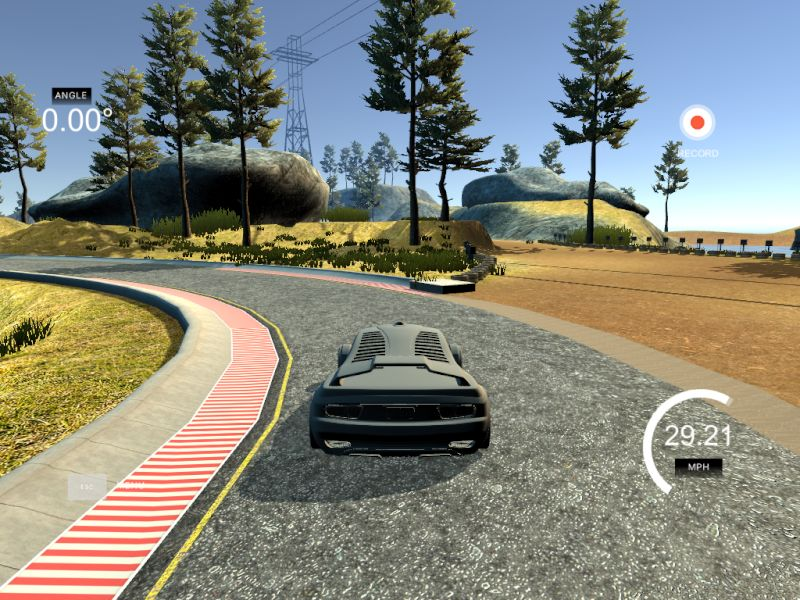

In addition, the test track (see image) was used as well to collect some data. Since it is very challenging to maneuver
even for a human due to the simulator's control scheme and physics of the track, only a single lap was driven in each direction. However, since
this track contains a two-lane road (as opposed to the training track), care was taken to stay in the right lane
(literally) wherever possible. This is a major difference from the samples of the training track, where the car is
essentially free to drive anywhere on the road.

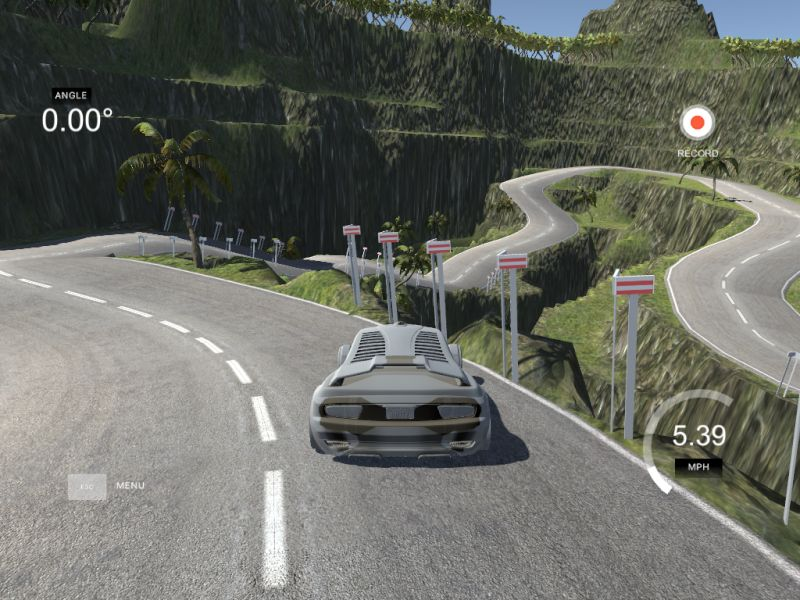

While driving, the simulator records low-resolution (320x160) RGB images from three cameras mounted to the left,
center and right of the car;
during inference, only the center camera would be used to predict steering angles. Here are some examples of what
the camera sees during driving:
 
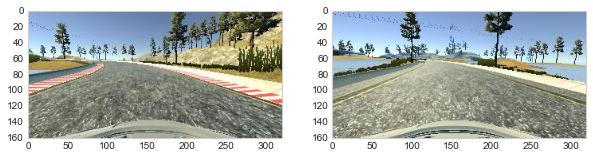
 
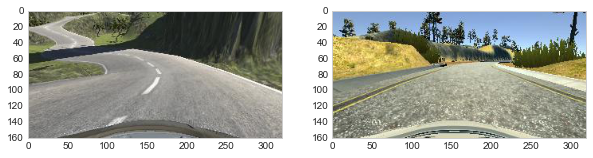

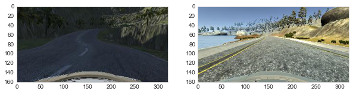

While the training track has some changing texture for the streets to simulate various grounds, the
test track mainly has narrow turns, hills and valleys, as well as changing light conditions. 

We can see from the training track examples that the upper part of the images mostly contains sky; in all cases,
the lower part of the images contains the hood/bonnet of the car. While the sky gives no information relevant to
steering (unless it is on the bottom part of the image, in which case we have flipped over), the bottom
part gives away the location of the camera. Because of that, images were cropped to remove parts of the sky
and the bottom, with amounts specific to the implemented model. Here's an example of how the actual training
and inference input would look like:

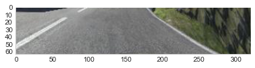

During data recording, speed, steering angle, throttle and brake values were captured alongside the images. For each sample,
the locations of the center, left and right images, as well as numerical values for the specified metrics were stored
in a CSV file. In these example rows, the car is driving 30.2 miles/hour (about 50 km/h) at full throttle without steering.

```csv
center_2018_10_07_22_13_46_745.jpg,left_2018_10_07_22_13_46_745.jpg,right_2018_10_07_22_13_46_745.jpg,0,1,0,30.19032
center_2018_10_07_22_13_46_828.jpg,left_2018_10_07_22_13_46_828.jpg,right_2018_10_07_22_13_46_828.jpg,0,1,0,30.19033
```

The histogram of steering angles shows that mostly, zero steering angles were recorded, whereas the rest of the
angles is approximately equally distributed between negative (left) and positive (right) steering commands.
Data augmentation was later used to iron out small discrepancies by randomly flipping the images and angles horizontally.
To not overfit on "zero" angles, only 10% of them were selected for training.

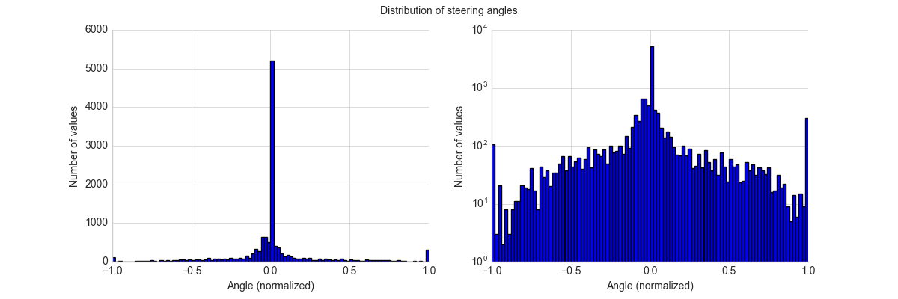

Looking at the speed values, we find that the car was mostly driven at full speed, with some acceleration 
going on in between. There is a small amount of "zero" speed situations that were further dropped during
training. The rationale here is that at zero speed, the steering angle also has no influence; if the model
were to be trained to control speed as well, it shouldn't
learn how to _not_ drive.

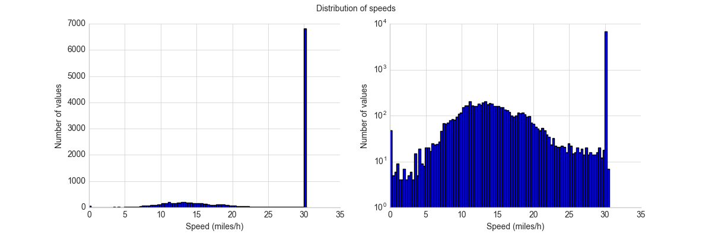

### Baseline model implementation

As a baseline model, the architecture suggested by NVIDIA in the [End to End Learning for Self-Driving Cars](https://images.nvidia.com/content/tegra/automotive/images/2016/solutions/pdf/end-to-end-dl-using-px.pdf)
paper was implemented:
 
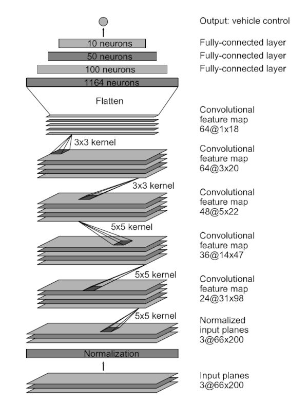
 
For this, the images were first resized to 200x105 pixels, then cropped to 200x66 pixels, leaving a bit of sky, after
which they were converted to YUV color space. Due to what I think is an error in the paper, the number of 
neurons in the network differed slightly after the flattening layer (1152 rather than 1164).

```text
Layer (type)                 Output Shape              Param #   
=================================================================
resize_image (Lambda)        (None, 105, 200, 3)       0         
_________________________________________________________________
rgb_to_yuv (Lambda)          (None, 105, 200, 3)       0         
_________________________________________________________________
normalize (Lambda)           (None, 105, 200, 3)       0         
_________________________________________________________________
crop (Cropping2D)            (None, 66, 200, 3)        0         
_________________________________________________________________
conv_1 (Conv2D)              (None, 31, 98, 24)        1824      
_________________________________________________________________
conv_1_relu (Activation)     (None, 31, 98, 24)        0         
_________________________________________________________________
conv_2 (Conv2D)              (None, 14, 47, 36)        21636     
_________________________________________________________________
conv_2_relu (Activation)     (None, 14, 47, 36)        0         
_________________________________________________________________
conv_3 (Conv2D)              (None, 5, 22, 48)         43248     
_________________________________________________________________
conv_3_relu (Activation)     (None, 5, 22, 48)         0         
_________________________________________________________________
conv_4 (Conv2D)              (None, 3, 20, 64)         27712     
_________________________________________________________________
conv_4_relu (Activation)     (None, 3, 20, 64)         0         
_________________________________________________________________
conv_5 (Conv2D)              (None, 1, 18, 64)         36928     
_________________________________________________________________
conv_5_relu (Activation)     (None, 1, 18, 64)         0         
_________________________________________________________________
flatten_1 (Flatten)          (None, 1152)              0         
_________________________________________________________________
fc_1 (Dense)                 (None, 100)               115300    
_________________________________________________________________
fc_1_relu (Activation)       (None, 100)               0         
_________________________________________________________________
fc_2 (Dense)                 (None, 50)                5050      
_________________________________________________________________
fc_2_relu (Activation)       (None, 50)                0         
_________________________________________________________________
fc_3 (Dense)                 (None, 10)                510       
_________________________________________________________________
fc_3_relu (Activation)       (None, 10)                0         
_________________________________________________________________
angle (Dense)                (None, 1)                 11        
=================================================================
Total params: 252,219
Trainable params: 252,219
Non-trainable params: 0
_________________________________________________________________
``` 

The network was first trained without augmentations, using Adam optimizer with standard parameters on MSE loss,
until the validation accuracy didn't improve for 20 epochs.

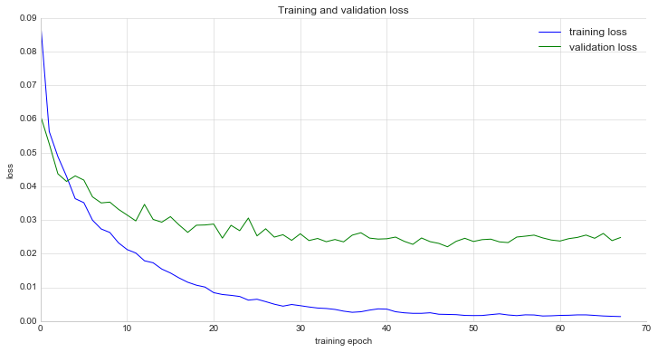

Given that the validation loss didn't seem to _increase_, it appears that further training, possibly using a smaller
learning rate or rate decay, would have improved the results further.

The model is stored as 

- `models/nvidia.48-0.0221.h5`.

A videos of the models performing successfully on the training track can be found at

- [`video/nvidia.48-0.0221.mp4`](video/nvidia.48-0.0221.mp4).

### Adding data augmentation

Using the same model, data augmentation was added by introducing:

- random horizontal flipping,
- random selection of different cameras with angle adjustment (arbitrarily chosen value of `0.2`) and
- gaussian noise on the steering angles.

Recording images from two different camera perspectives effectively triples the training data and allows the model
to learn how to recenter itself onto the lane when it drives too far to its side. In theory, this can be solved
by actively driving off the lane and then recording how to get back into a safe position, but that is nothing one
would like to do in real life. Using multiple cameras - as is suggested in the NVIDIA paper - 
is a clever trick to solve that problem.

The following image shows the intuition about the angle adjustment when using different camera positions: If the
destination angle as measured by the center camera stays the same, selecting a camera to the left means the angle
needs to be decreased, whereas selecting a camera to the right implies increasing the angle. As far as the model
is concerned, the orientations of the angles are changed (positive means right), but the behavior stays the same.
For this project, the value of `0.2` was chosen mainly because there is no real information about the physical
system (e.g. the distance of the cameras, scale of the car with respect to the scene, etc.). The value corresponds
to a steering of `5` in the simulator, whose range is `-25 ... 25`.

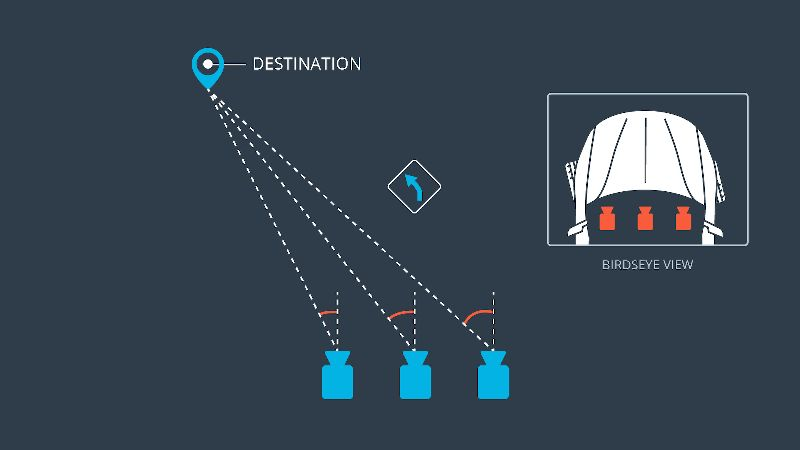

Using the augmentation - and mainly due to the added noise - training loss was now much higher than validation loss.
Still though, the variation in images resulted in a model that was much more effective on both tracks.
Overfitting still doesn't seem to be an issue.

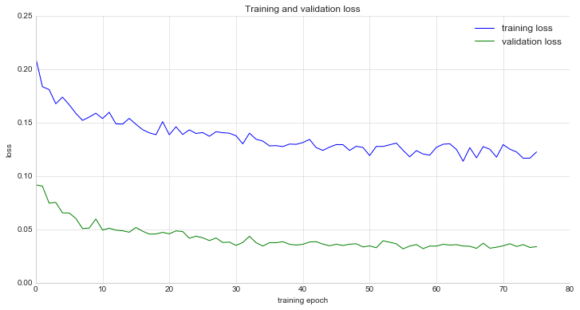

The model is stored as 

- `models/nvidia-aug.56-0.0317.h5` 

respectively. A video of the models performing successfully on the training track can be found at

- [`video/nvidia-aug.56-0.0317.mp4`](video/nvidia-aug.56-0.0317.mp4)

with videos of the model running (and failing) on the test track are available here:

- [`video/nvidia-aug-2.56-0.0317.mp4`](video/nvidia-aug-2.56-0.0317.mp4)
- [`video/nvidia-aug-2_longer.56-0.0317.mp4`](video/nvidia-aug-2_longer.56-0.0317.mp4)

Video recordings from the simulator can be found [here on YouTube](https://www.youtube.com/watch?v=mL6ASo7dZX0) for
the training track and [here](https://www.youtube.com/watch?v=sxXvtvNnhzQ) for the test track (the latter of
which works better with sound enabled, I'd argue).

<a href="https://www.youtube.com/watch?v=mL6ASo7dZX0">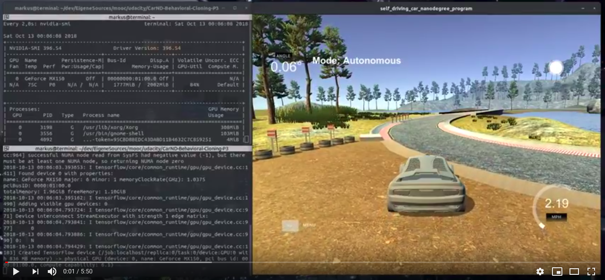</a>

<a href="https://www.youtube.com/watch?v=sxXvtvNnhzQ">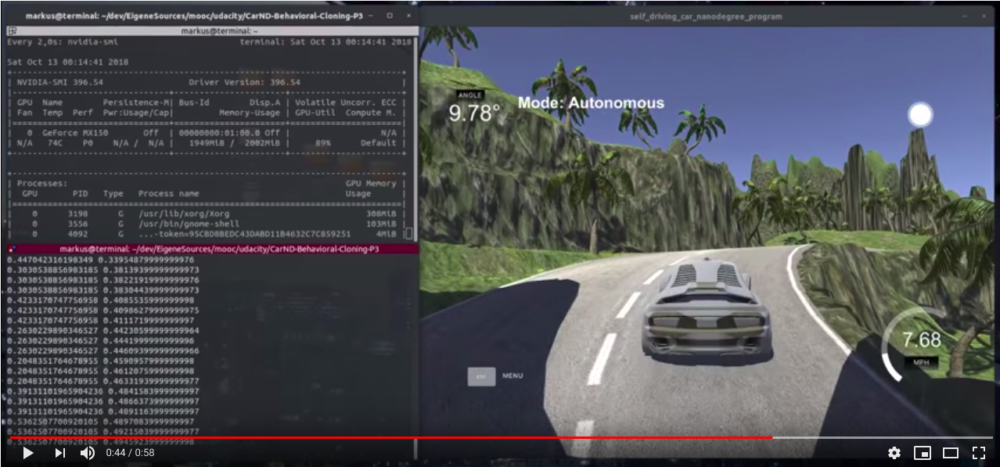</a>

### Custom model implementation

The project required the use of countermeasures to overfitting, such as dropout or regularization. Because
the network architecture had to be changed anyway, I factored in additional changes:

- The original image size of 160x320 was used, i.e. resizing was removed,
- 2D convolutions were replaced with depthwise separable 2D convolutions,
- ReLU activations were replaced with Parametric ReLU, and
- Dropout was added before the first fully connected layer.

The removal of the resizing step was done purely to improve processing speed; at the same time, the introduction of 
depthwise separable convolutions should allow for some reduction of parameters as well. Much more importantly, using 
a depthwise separable convolution in the input layer follows the intuition that grayscale intensity matters much 
more to lane detection than color. By learning filters individually for the luminance (Y) and chrominance (U and V)
channels, it should be possible to focus the training on the more important channels rather than trying to use them
simultaneously. Separable convolutions are kept for later layers because of similar reasons; a rather efficient class
of neural networks designed for mobile use (such as embedded systems) using separable convolutions are MobileNets.

ReLU activations drop all negative activations, effectively cancelling out their gradient, possibly leading to "dead"
neurons during training (when a neuron's gradient is zero, no learning can happen ever again). While this allows for
pruning of the network, it possibly throws aways computational capabilities of the architecture. Hence, Parametric ReLU
units are used instead: Functioning like Leaky ReLU, a class of activation functions that "leaks" negative inputs
by using a small coefficient on them, Parametric ReLUs allow for learning that coefficient as
well at the cost of one extra trainable parameter per activation function. Nowadays, activation functions such as ELU
and SELU have proven to be more efficient in terms of training and inference quality (e.g. due to self-normalizing 
capabilities); they do rely on exponential
functions though, and since the goal is to have a network that should run as fast as possible on an embedded device,
I decided not to use them.

Lastly, dropout is applied exactly once. Since dropout randomly "suppresses" connections during training, the network
has to learn redundancy. When repeatedly using dropouts in subsequent layers, this only becomes worse. Again, pruning
may mitigate this effect by simply removing "identical" neurons. Since this is beyond the scope of this project, 
one instance of dropout in the network was deemed enough.

```text

_________________________________________________________________
Layer (type)                 Output Shape              Param #   
=================================================================
rgb_to_yuv (Lambda)          (None, 160, 320, 3)       0         
_________________________________________________________________
normalize (Lambda)           (None, 160, 320, 3)       0         
_________________________________________________________________
crop (Cropping2D)            (None, 63, 320, 3)        0         
_________________________________________________________________
conv_1 (SeparableConv2D)     (None, 20, 106, 24)       2376      
_________________________________________________________________
conv_1_prelu (PReLU)         (None, 20, 106, 24)       50880     
_________________________________________________________________
conv_2 (SeparableConv2D)     (None, 6, 34, 36)         13212     
_________________________________________________________________
conv_2_prelu (PReLU)         (None, 6, 34, 36)         7344      
_________________________________________________________________
conv_3 (SeparableConv2D)     (None, 2, 16, 48)         12360     
_________________________________________________________________
conv_3_prelu (PReLU)         (None, 2, 16, 48)         1536      
_________________________________________________________________
conv_4 (SeparableConv2D)     (None, 1, 8, 64)          29440     
_________________________________________________________________
conv_4_prelu (PReLU)         (None, 1, 8, 64)          512       
_________________________________________________________________
flatten_1 (Flatten)          (None, 512)               0         
_________________________________________________________________
dropout_1 (Dropout)          (None, 512)               0         
_________________________________________________________________
fc_1 (Dense)                 (None, 100)               51300     
_________________________________________________________________
fc_1_prelu (PReLU)           (None, 100)               100       
_________________________________________________________________
fc_2 (Dense)                 (None, 50)                5050      
_________________________________________________________________
fc_2_prelu (PReLU)           (None, 50)                50        
_________________________________________________________________
fc_3 (Dense)                 (None, 10)                510       
_________________________________________________________________
fc_3_prelu (PReLU)           (None, 10)                10        
_________________________________________________________________
angle (Dense)                (None, 1)                 11        
=================================================================
Total params: 174,691
Trainable params: 174,691
Non-trainable params: 0
_________________________________________________________________
```

From the training parameters, we already see that the model is smaller than the version proposed by NVIDIA,
leading to slightly lower memory requirements and faster inference times.

In addition to the network change, all of the images were now used actively, limiting image augmentation to flipping only.

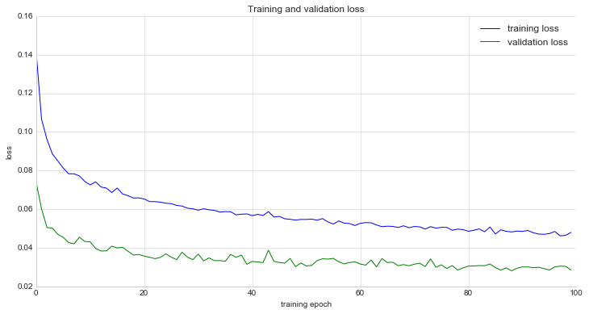

This network made it through the training track with ease and performed surprisingly well on the test track,
although it failed to complete it without accidents.

The model is stored as 

- `models/custom-1.89-0.0281.h5`

respectively. A video of the models performing successfully on the training track can be found at

- [`video/custom-1.89-0.0281.mp4`](video/custom-1.89-0.0281.mp4), 

while a video of it driving on the test track is at

- [`video/custom-1-1.89-0.0281.mp4`](video/customcustom-1-1.89-0.0281.mp4).

On the test track, all models failed in the higher sharp turns and on the bridge. Here, too, the car had to be
reset after crashing into barriers once. To its defense, not alot of training data was available at these points
since they are somewhat hard to reach after starting the simulator.

[Here's](https://www.youtube.com/watch?v=w-A2suUnKYw) a video of the simulator with the model driving halfway around 
the test track (running the training track works perfectly but does look somewhat boring).

<a href="https://www.youtube.com/watch?v=w-A2suUnKYw">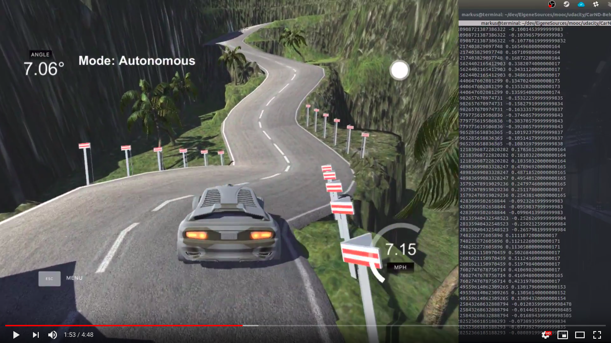</a>

From the driving itself, it seems that the model is steering much more often (and more aggressively at that) than
before. One could possibly introduce more "zero angle" examples to help it to learn more about "smooth" driving.
When running the model in the simulator problematic situations arise the model doesn't know how to resolve, such as
switching lanes, driving dangerously close to the edge of the street and driving straightway into trees, straight
toward and eventually off cliffs. Here, it would make sense to gather more training data specifically about those
situations.
